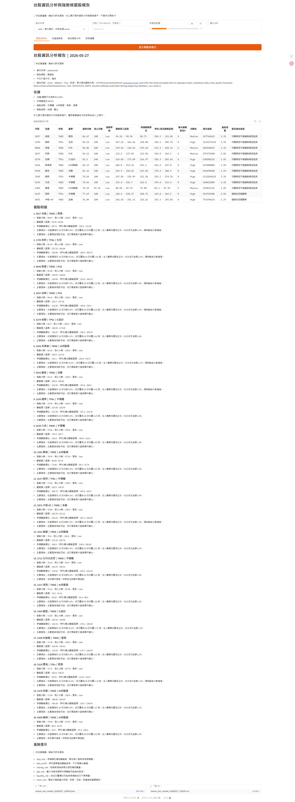
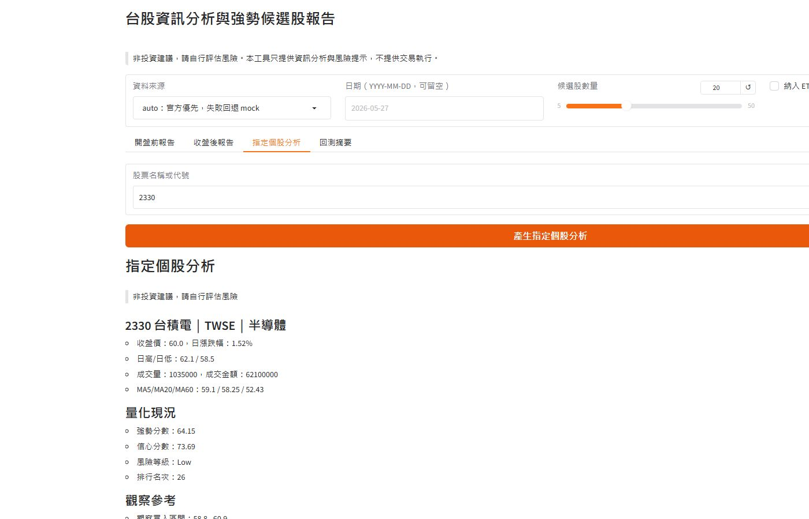
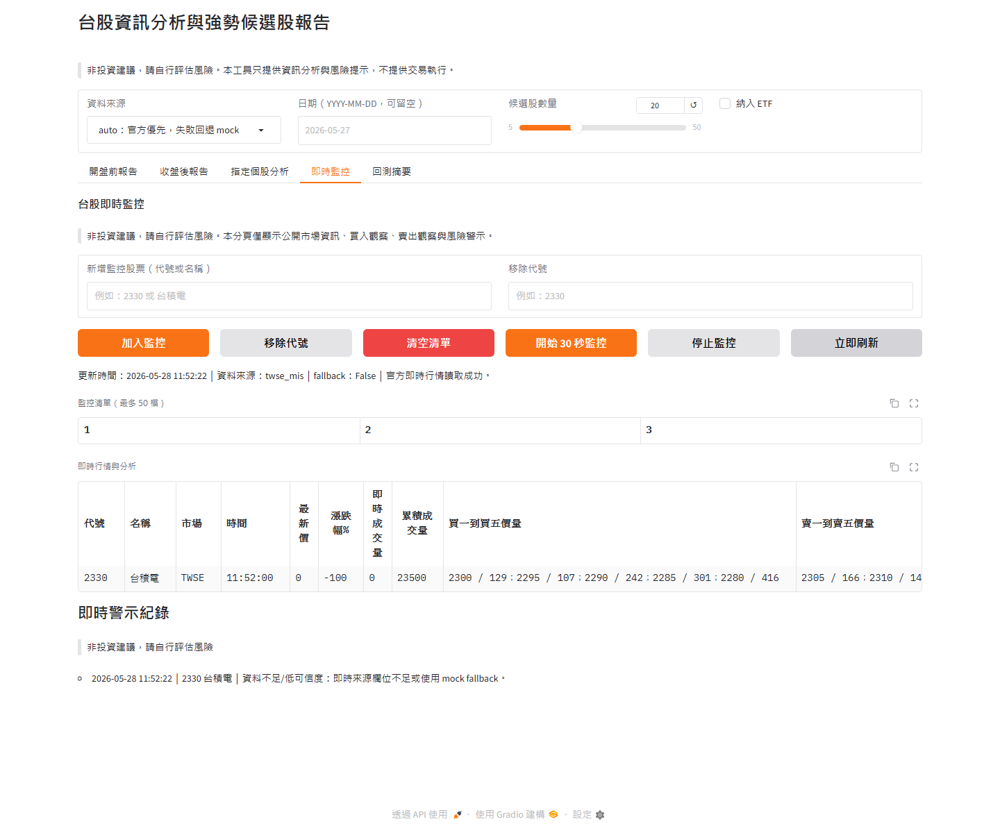

# 台股資訊分析 GUI｜V01.002

2026/05/27 Steve Peng：新增本獨立專案。
修改原因：只推送「台股分析 GUI 可執行功能」需要的最小檔案，不包含 QuantDinger 原專案既有交易模組、後端帳號系統、broker 模組或其他無關內容。

## 重要聲明

本工具只做資訊蒐集、量化分析、候選股篩選、風險提示與報告產生。所有輸出都會標示：

> 非投資建議，請自行評估風險

本工具沒有新增或提供下列功能：

- 真實下單
- 自動下單
- 半自動下單
- paper trading
- live trading
- broker API
- 券商連線
- order service
- buy/sell button
- 委託單
- 任何交易執行功能

實際買賣請使用者自行到券商系統人工操作。

## 功能總覽

- **開盤前報告**：顯示今日大盤方向、依據與前 N 檔強勢候選股。
- **收盤後報告**：顯示今日回顧、族群強弱、明日觀察方向與候選股。
- **強勢候選股排行榜**：依量價、均線、法人籌碼估算、流動性與事件風險計算強勢分數。
- **指定個股分析**：輸入股票代號或名稱，例如 `2330` 或 `台積電`，查看單檔現況與風險說明。
- **即時監控**：最多加入 50 檔股票，讀取 TWSE MIS 官方即時行情，顯示五檔委買委賣、成交量、30 秒刷新、買入觀察/賣出觀察與大漲/大跌風險警示。
- **資訊型回測摘要**：以候選股歷史報酬序列估算勝率、平均報酬、最大回撤與 Sharpe-like 指標。
- **JSON / CSV 下載**：報告與表格可直接下載，預設輸出到 `reports/`。
- **離線 mock 資料**：無網路時仍可展示 GUI 與完整流程。
- **官方資料 auto 模式**：嘗試使用 TWSE / TPEx 官方 OpenAPI，失敗時自動回退 mock。

2026/05/29 Steve Peng：強化開盤前評估。
修改原因：使用者要求開盤前報告納入前一日美股、台期夜盤與前 10 日買賣量/金額走勢，並反映到各股分數與風險。
修改前內容：開盤前方向主要依台股日資料與候選股量價條件判斷。
修改後功能：開盤前報告新增 `美股與台期夜盤綜合評估`、`前 10 日買賣量與金額走勢`；候選股表格新增 `開盤前情境調整` 與 `開盤前情境`，強勢分數與風險理由會納入這些資料。

2026/05/29 Steve Peng：新增 GUI 版號與修正即時監控啟動刷新。
修改原因：使用者回報即時監控啟動後沒有更新行情，且要求抬頭名稱加入版號控制，目前為 `V01.001`。
修改前內容：頁面抬頭與瀏覽器標題沒有版號；`開始 30 秒監控` 只啟動 timer 與更新狀態，表格需等下一次 timer tick 或手動按 `立即刷新` 才會出現行情。
修改後功能：GUI 抬頭與瀏覽器標題顯示 `台股資訊分析與強勢候選股報告｜V01.001`；按下 `開始 30 秒監控` 會先立即刷新一次行情，再進入 30 秒自動刷新。

2026/05/29 Steve Peng：修正即時行情表格在深色主題下看似無資料。
修改原因：使用者回報即時監控仍像沒有資料；實際症狀是表格列底使用淺色紅綠背景，文字在深色 Gradio 主題下對比不足，且 TWSE MIS 最新成交價暫缺時會顯示 `0.0` / `-100%`。
修改前內容：即時行情表格資料列很淡不易閱讀；官方回傳 `z=-` 或 `0` 時，最新價欄位顯示 `0.0`，漲跌幅誤算成 `-100%`。
修改後功能：版號升為 `V01.002`；即時行情表格改為深色高對比樣式；最新成交價暫缺時顯示 `成交價暫缺`，不再顯示 `0.0` 或 `-100%`，五檔委買委賣資料仍會顯示。

## 專案檔案說明

| 檔案 | 說明 |
|---|---|
| `AGENTS.md` | AI 代理接手規範、限制與最短重建流程 |
| `docs/AI_HANDOFF_CHECKLIST.md` | 完整 AI 交接清冊，供後續 AI 直接接續任務 |
| `app.py` | Gradio 圖形化介面，啟動後開啟 `http://127.0.0.1:7860` |
| `taiwan_market_core.py` | 台股分析核心邏輯、資料 provider、排行、報告、指定個股分析與回測 |
| `run_taiwan_market_ui.cmd` | Windows 雙擊啟動檔 |
| `requirements.txt` | Python 依賴套件 |
| `tests/test_core.py` | 核心功能與 GUI callback 測試 |
| `reports/` | 執行後產生的 JSON / CSV 報告，已加入 `.gitignore` |

## AI 交接文件

2026/05/28 Steve Peng：新增本節。
修改原因：使用者表示本機工作目錄會刪除，後續任務需要能由其他 AI 只靠 GitHub repo 接手。
修改前內容：README 沒有集中列出 AI 接手入口。
修改後功能：提供交接文件索引與重建提醒。

若後續由其他 AI 或開發者接手，請先閱讀：

1. [`AGENTS.md`](AGENTS.md)：AI 代理工作規範、禁止事項、驗證流程。
2. [`docs/AI_HANDOFF_CHECKLIST.md`](docs/AI_HANDOFF_CHECKLIST.md)：完整交接清冊、環境重建、模組說明、已知限制與後續任務。

本機資料刪除後，可直接從 GitHub 重新 clone：

```bash
git clone https://github.com/Lzxpan/taiwan-stock-analysis-ui.git
cd taiwan-stock-analysis-ui
pip install -r requirements.txt
python -m pytest -q
python app.py
```

## 安裝方式

2026/05/28 Steve Peng：修正啟動失敗。
修改原因：Windows 繁中 locale 的舊版 `pip` 會用 `cp950` 讀取 `requirements.txt`，遇到 UTF-8 中文註解會出現 `UnicodeDecodeError`；另外 `gradio 4.44.1` 與 `huggingface_hub 1.x` 不相容，會出現 `ImportError: cannot import name 'HfFolder'`；新版 `pydantic` 產出的 API schema 會讓 `gradio_client` 出現 `TypeError: argument of type 'bool' is not iterable`；Gradio 4 的 `launch()` 不接受 `css` / `js` 參數。
修改前內容：依賴版本與 requirements 編碼未明確鎖定，部分 Windows 環境無法完成套件安裝並啟動 GUI。
修改後功能：`requirements.txt` 明確宣告 UTF-8，並鎖定 `huggingface_hub<1.0` 與 `pydantic<2.11`；Windows 啟動檔會啟用 UTF-8 並在缺少 `pip` 時嘗試 `ensurepip`；`css` / `js` 已移到 `gr.Blocks()`。

### 方式一：Windows 雙擊執行

1. 確認電腦已安裝 Python 3.10 或更新版本。
2. 下載或 clone 本專案。
3. 雙擊：

```text
run_taiwan_market_ui.cmd
```

啟動檔會自動：

1. 檢查 Python。
2. 檢查 `gradio`、`pandas`、`requests`。
3. 缺少套件時執行 `pip install -r requirements.txt`。
4. 啟動 GUI。
5. 開啟瀏覽器到 `http://127.0.0.1:7860`。

### 方式二：命令列執行

```bash
pip install -r requirements.txt
python app.py
```

開啟：

```text
http://127.0.0.1:7860
```

## 操作說明

### 1. 選擇資料來源

畫面上方可選：

- `auto`：預設，先嘗試官方資料，失敗時回退 mock。
- `official`：只使用 TWSE / TPEx 官方 OpenAPI。若官方資料失敗，畫面會顯示錯誤。
- `mock`：離線示範資料，最適合第一次測試。

### 2. 設定日期

日期格式：

```text
YYYY-MM-DD
```

可留空，系統會使用 Asia/Taipei 今日日期。

### 3. 設定候選股數量

用 `候選股數量` 滑桿選擇 Top N，例如 20。

### 4. 是否納入 ETF

預設不納入 ETF。若勾選 `納入 ETF`，ETF 會一起進入股票池與指定個股分析。

## 功能操作

### 開盤前報告

1. 切到 `開盤前報告` 分頁。
2. 點擊 `產生開盤前報告`。
3. 查看報告摘要、美股與台期夜盤綜合評估、前 10 日買賣量/金額走勢、強勢候選股排行榜、個股明細與風險提示。
4. 可下載 JSON / CSV。

### 收盤後報告

1. 切到 `收盤後報告` 分頁。
2. 點擊 `產生收盤後報告`。
3. 查看今日回顧、族群強弱、明日觀察方向與候選股。
4. 可下載 JSON / CSV。

### 指定個股分析

1. 切到 `指定個股分析` 分頁。
2. 在 `股票名稱或代號` 輸入：

```text
2330
```

或：

```text
台積電
```

3. 點擊 `產生指定個股分析`。
4. 會顯示：
   - 股票代號、名稱、市場別與產業
   - 收盤價、日漲跌幅、日高/日低
   - 成交量、成交金額、均線
   - 強勢分數、信心分數、風險等級
   - 排行名次或未納入排行原因
   - 觀察買入區間
   - 停損觀察價位
   - 停利/賣出觀察區間
   - 追高適合度
   - 主要理由、主要風險與事件風險

### 即時監控

2026/05/28 Steve Peng：新增本節。
修改原因：新增台股即時監控功能，需要補上安裝後的實際操作流程與資料限制。
修改前內容：README 只說明報告、指定個股分析與回測。
修改後功能：說明最多 50 檔、30 秒刷新、TWSE MIS、五檔價量與警示規則。

2026/05/28 Steve Peng：修正右鍵加入即時監控。
修改原因：右鍵選單原本依賴 `visible=False` 的隱藏 Gradio 元件，瀏覽器中無法穩定觸發 callback。
修改前內容：選取個股後右鍵點 `加入即時監控` 可能沒有更新監控清單。
修改後功能：右鍵點 `加入即時監控` 會切到 `即時監控` 分頁、填入股票代號並執行既有 `加入監控` 流程。

1. 切到 `即時監控` 分頁。
2. 在 `新增監控股票（代號或名稱）` 輸入 `2330` 或 `台積電`。
3. 點擊 `加入監控`，最多可加入 50 檔；重複加入會顯示提示。
4. 點擊 `立即刷新` 可手動更新一次。
5. 點擊 `開始 30 秒監控` 後，會立即刷新一次行情，之後每 30 秒自動刷新。
6. 點擊 `停止監控` 可停止自動刷新。
7. 監控清單保存於 `runtime/watchlists/realtime_monitor.json`，此資料已被 `.gitignore` 排除。
8. 非台股一般交易時段（週一至週五 09:00-13:30 以 Asia/Taipei 判斷）按下 `立即刷新` 或 `開始 30 秒監控`，畫面會顯示「現在非台股一般交易時段，無法啟動即時監控」，並保持停止監控中。
9. 在頁面上選取股票代號或名稱後按右鍵，可從選單直接執行 `加入即時監控` 或 `指定個股分析`。

即時監控顯示欄位：

- 最新價、漲跌幅、即時成交量、累積成交量
- 趨勢欄位會以文字標示 `上漲`、`下跌` 或 `平盤`，即時行情列會用紅色或綠色底色輔助辨識
- 買一到買五價格與數量，格式為 `買一 價 2285 / 量 361張`
- 賣一到賣五價格與數量，格式為 `賣一 價 2290 / 量 30張`
- 委買總金額、委賣總金額、委買委賣比、價差
- 資料來源、可信度、資料備註、分析狀態、警示訊息
- 若官方即時欄位短暫回傳 0，最新價與即時成交量會沿用上一筆有效資料，並在 `資料備註` 標示低可信度原因

警示規則：

- 價格進入既有分析的觀察買入區間：顯示 `買入觀察`
- 價格進入停利/賣出觀察區間：顯示 `賣出觀察`
- 價格跌破停損觀察價：顯示 `停損風險觀察`
- 漲跌幅、成交量或委買委賣失衡達規則門檻：顯示大漲/大跌風險觀察
- 官方即時資料欄位不足或 fallback mock：顯示 `資料不足/低可信度`

### 回測摘要

1. 切到 `回測摘要` 分頁。
2. 選擇回測天數。
3. 點擊 `產生資訊型回測摘要`。
4. 查看勝率、平均報酬、累積報酬、最大回撤與 Sharpe-like 指標。

## 截圖說明

### 主畫面與開盤前報告



### 指定個股分析



### 即時監控



## 資料來源

- TWSE OpenAPI：https://openapi.twse.com.tw/
- TPEx OpenAPI：https://www.tpex.org.tw/openapi/
- TWSE MIS 基本市況報導：https://mis.twse.com.tw/
- Mock provider：內建離線示範資料，不需要 API key。

官方資料若欄位不足、網路失敗或端點異常，`auto` 模式會 fallback mock，不會假裝資料完整。

即時監控優先使用 TWSE MIS 官方公開即時行情，嘗試上市 `tse_代號.tw` 與上櫃 `otc_代號.tw` 通道。TWSE MIS 可提供公開市場即時交易資訊與五檔價量；本工具只讀取公開市場資料，不讀取個人委託、成交、刪單或券商帳戶狀態。

## 分析結果的來源數據

本工具的分析結果來自 `taiwan_market_core.py` 內的資料 provider。不同資料來源的欄位與可信度如下。

### 1. Mock provider

`mock` 是內建離線示範資料，不需要網路或 API key。主要用途是讓使用者第一次安裝後即可確認 GUI、報告、指定個股分析與下載功能是否正常。

Mock provider 內建欄位包含：

- 股票代號
- 股票名稱
- 市場別：`TWSE` 或 `TPEx`
- 產業分類
- 收盤價
- 前一日收盤價
- 日高 / 日低
- 成交量
- 成交金額
- 5 日均線
- 20 日均線
- 60 日均線
- 20 日均量
- 外資買賣超估算
- 投信買賣超估算
- 自營商買賣超估算
- 可用資料天數
- ETF 標記
- 全額交割 / 處置 / 異常標記
- 事件風險
- 歷史報酬序列，用於資訊型回測摘要

Mock provider 的數據不是即時市場資料，僅用於功能展示、UI 驗證、離線測試與流程示範。

### 2. Official provider

`official` 會嘗試讀取官方 OpenAPI：

- TWSE：`https://openapi.twse.com.tw/v1/exchangeReport/STOCK_DAY_ALL`
- TPEx：`https://www.tpex.org.tw/openapi/v1/tpex_mainboard_daily_close_quotes`
- TWSE 10 日市場成交資訊：`https://www.twse.com.tw/rwd/zh/afterTrading/FMTQIK`
- TAIFEX 期貨每日交易行情：`https://openapi.taifex.com.tw/v1/DailyMarketReportFut`
- 美股主要指數：透過 Yahoo Finance chart 公開端點讀取 `S&P 500`、`Nasdaq`、`Dow Jones`、`Philadelphia Semiconductor`，失敗時使用 mock fallback。

目前 official provider 使用的主要欄位包含：

- 股票代號
- 股票名稱
- 收盤價
- 漲跌
- 成交量
- 成交金額
- 最高價
- 最低價
- 市場別

限制：

- 官方日資料不一定包含完整產業分類。
- 官方日資料不一定包含完整歷史均線。
- 官方日資料不一定包含完整三大法人、MOPS 重大訊息、TDCC 籌碼、TAIFEX 衍生性商品資訊。
- 若官方資料缺少歷史資料，工具會用有限欄位做保守估算，並在分析中保留風險提示。

### 3. Auto provider

`auto` 是預設資料來源：

1. 先嘗試 official provider。
2. 如果官方端點失敗、網路失敗、憑證失敗或資料不足，改用 mock provider。
3. GUI 會在報告中顯示 `data_source_status`，說明是否 fallback。

## 推斷理由與量化依據

本工具的推斷不是主觀喊單，而是根據可解釋的量化欄位產生資訊型觀察結果。

### 1. 股票池過濾

強勢候選股排行榜會先排除不適合納入排行的標的：

- 非 TWSE / TPEx 標的
- ETF，除非使用者勾選 `納入 ETF`
- 全額交割股
- 處置股
- 重大異常或警示標的
- 可用資料天數不足
- 成交量或成交金額過低
- 價格、均線或均量資料不足

指定個股分析不會直接排除該股票，而是會顯示「是否納入強勢排行股票池」與排除原因。

### 2. 強勢分數

強勢分數由下列項目加總：

- `price_momentum`：價格動能，參考日漲跌幅、收盤價相對 20 日均線、20 日均線相對 60 日均線。
- `volume_momentum`：量能動能，參考成交量相對 20 日均量。
- `institutional_flow`：法人籌碼估算，參考外資、投信、自營商買賣超估算占成交金額比例。
- `liquidity_quality`：流動性品質，參考成交金額。
- `event_penalty`：事件風險扣分，若存在事件風險會扣分。

分數越高代表量價與趨勢條件越強，但不代表可以買進。

### 3. 信心分數

信心分數主要依據：

- 可用資料天數
- 成交金額與流動性
- 是否存在事件風險

資料不足、流動性不足或事件風險偏高時，信心分數會降低。

### 4. 風險等級

風險等級分為 `Low`、`Medium`、`High`，依據包含：

- 單日漲幅是否過大
- 成交量是否異常放大
- 成交金額是否偏低
- 是否存在事件風險
- 是否為處置、警示、全額交割或資料不足標的

### 5. 觀察價位區間

觀察價位是資訊型參考，不是買賣建議：

- 觀察買入區間：以收盤價附近的保守區間估算。
- 停損觀察價位：以收盤價與 20 日均線推估風險線。
- 停利 / 賣出觀察區間：以收盤價上方區間做觀察參考。
- 最大觀察部位比例：依風險等級與流動性調整。

這些欄位只用於風險思考，不代表實際交易指令。

## 開發、驗證與發布流程

本專案建立時使用下列工作方式，方便後續維護者追溯分析結果與交付流程。

### GitHub 方式

- 使用 GitHub CLI 驗證登入狀態。
- 建立新的獨立 repository：`Lzxpan/taiwan-stock-analysis-ui`。
- 直接推送到 `main`，不使用 QuantDinger 原 repo 的功能分支。
- 只提交獨立可執行檔案：
  - `app.py`
  - `taiwan_market_core.py`
  - `run_taiwan_market_ui.cmd`
  - `requirements.txt`
  - `README.md`
  - `tests/test_core.py`
  - `docs/images/*.png`
- 不提交 `reports/` 執行輸出資料。

### Superpowers 方式

開發流程採用可驗證的工程步驟：

1. 先確認需求範圍：只保留可執行台股分析 GUI，不帶入原 QuantDinger 交易模組。
2. 以測試保護核心功能：排行榜、指定個股分析、GUI callback 與 read-only 邊界。
3. 在完成前執行驗證：
   - `pytest -q`
   - `python -m compileall app.py taiwan_market_core.py`
4. 掃描交易執行相關字串，確認沒有新增 broker、order、live trading、paper trading 或買賣按鈕入口。
5. 確認 README、截圖、啟動檔與 GitHub repo 都能對應到同一個可執行版本。

### Chrome 方式

使用 Chrome 驗證 GUI 實際畫面：

1. 啟動本機 Gradio UI。
2. 開啟 `http://127.0.0.1:7860` 或測試用 port。
3. 點擊 `產生開盤前報告`，確認報告、排行榜、個股明細與下載檔顯示正常。
4. 切換到 `指定個股分析` 分頁。
5. 輸入 `2330`。
6. 點擊 `產生指定個股分析`。
7. 擷取畫面並保存到：
   - `docs/images/home-pre-market.png`
   - `docs/images/stock-analysis.png`

README 中的截圖就是依上述流程由本機 UI 實際擷取，不是手繪示意圖。

## 測試

```bash
pytest -q
python -m compileall app.py taiwan_market_core.py realtime_monitor.py
```

## 常見問題

### 1. 第一次開啟很慢？

第一次執行可能需要安裝 Python 套件，請等待命令列安裝完成。

### 2. 官方資料抓不到？

請改用 `mock` 資料來源確認 UI 是否正常。官方 OpenAPI 可能因網路、憑證、欄位變動或端點暫時不可用而失敗。

### 3. 這個工具可以直接買賣股票嗎？

不可以。本工具只顯示資訊分析與風險提示，沒有任何下單或交易執行功能。
